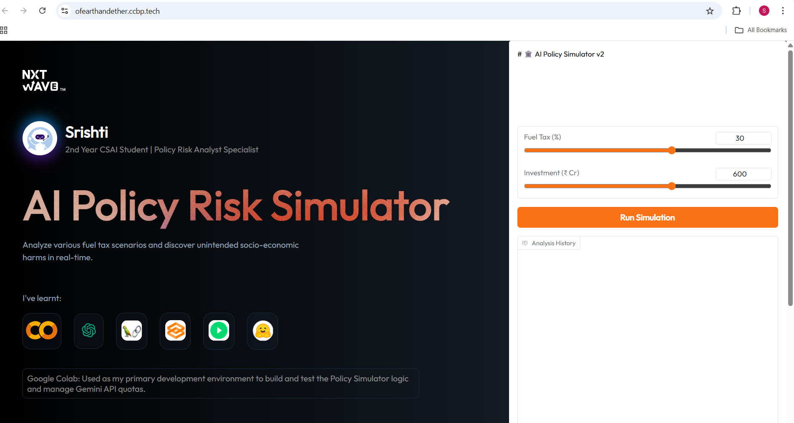

# AI POLICY RISK SIMULATOR

## Quantifying Unintended Harms in the Indian Economy
__Developer__: Srishti | 2nd Year CSAI Student | NSUT __Tech Stack__: Google Gemini 2.5 Flash-Lite, LangChain, Gradio, Python

## THE VISION
Most Large Language Models lack deep local socio-economic context. This project bridges that gap by creating a specialized Policy Analyst Persona. The simulator evaluates government policy changes (such as fuel taxes) and identifies second-order effects on BPL (Below Poverty Line) families, MSMEs, and the informal sector in India.

## SYSTEM ARCHITECTURE
The simulator follows a modular AI architecture designed for scalability and resilience:

* __Frontend (UI)__: A responsive web interface built on the CCBP Playground using HTML5, CSS3, and JavaScript, which embeds the logic layer.
  * Implements a responsive dashboard that embeds the AI engine via Gradio-app components.

* __Logic Layer (Deployment)__: Hosted on Hugging Face Spaces for high availability.
  * Utilizes Gradio for an interactive UI featuring dynamic sliders and real-time chat history.

* __Intelligence Engine__
  * __Framework__: LangChain for structured prompt orchestration.
  * __Model__: Gemini 2.5 Flash-Lite for optimized reasoning and high-throughput API handling.

* __Architecture Diagram Concept__:     
```
[User Input: Sliders] -> [Gradio Interface] -> [LangChain Prompt Template] -> [Gemini 2.5 Flash-Lite API] -> [Risk Analysis Output]
```    

## Technical Stack
* __Language__: Python 3.10+

* __LLM Engine__: Google Gemini 2.5 Flash-Lite

* __Orchestration__: LangChain

* __Web Framework__: Gradio 6.0

* __Hosting__: Hugging Face Spaces & CCBP Code Playground

## Directory Structure
```
AI-Policy-Simulator/
├── app.py                # Production entry point (Gradio + Gemini 2.5)
├── requirements.txt      # Backend dependencies for Hugging Face deployment
├── README.md             # Project documentation & technical roadmap
├── notebooks/            # Research & Model Experimentation
│   └── MyProject_Chat_Bot.ipynb  # Google Colab notebook for prompt testing
├── web/                  # Custom Web Frontend (Decoupled UI)
│   ├── AI_Policy_Simulator_GenAI_workshop.html        
│   ├── AI_Policy_Simulator_GenAI_workshop.css         
│   └── AI_Policy_Simulator_GenAI_workshop.js         
└── assets/               # Screenshot and Simulation video
    ├── Simulation.mp4    
    └── ccbp_website.png      
```

## ENGINEERING MILESTONES

1. __Handling Quota Constraints (The 429 Challenge)__
During development, the flagship Gemini 2.0 Flash model hit strict rate limits (ResourceExhausted: 429).

* __Resolution__: I performed a technical assessment and migrated the engine to Gemini 2.5 Flash-Lite. This increased the request ceiling from 200 to 1,000 requests per day, ensuring the simulator remains highly available for evaluators and public testing.

2. __Security & Credential Engineering__
To maintain professional security standards, I avoided hardcoding API keys.

* __Resolution__: Implemented Hugging Face Secrets. The app.py script pulls the GOOGLE_API_KEY from the environment variables, ensuring that even if the repository is public on GitHub, the credentials remain encrypted and safe.

3. __Compatibility Migration__
The project was built during a transition period for UI frameworks.

* __Resolution__: Navigated breaking changes in Gradio 6.0 (specifically the removal of the type argument in Chatbot) by refactoring the frontend logic to match the new native "messages" format.

## Setup & Installation

1. __Clone the repository__
```
git clone https://github.com/YOUR_USERNAME/AI-Policy-Simulator.git
cd AI-Policy-Simulator
```

2. __Install dependencies__
```
pip install -r requirements.txt
```

3. __Set Environment Variables Create a .env file or export your API key:__
```
export GOOGLE_API_KEY="your_actual_api_key_here"
```

4. __Run locally__
```
python app.py
```

## FUTURE ROADMAP
* __RAG Integration:__ Implementing Retrieval-Augmented Generation to allow the AI to "read" actual __Union Budget PDF__ documents and provide data-backed risk scores.

* __Socio-Economic Heatmaps:__ Visualizing the impact of policy changes across different __Indian states__ using a Python-based mapping library like __Folium__.


## Live Links
* Interactive App: [Hugging Face Space](https://ofearthandether-policy-simulator.hf.space)

https://github.com/user-attachments/assets/f0b89e6e-c9e3-427f-9156-a30fa9fb4f64

* Frontend Website: [CCBP Published Link](https://ofearthandether.ccbp.tech)



---
